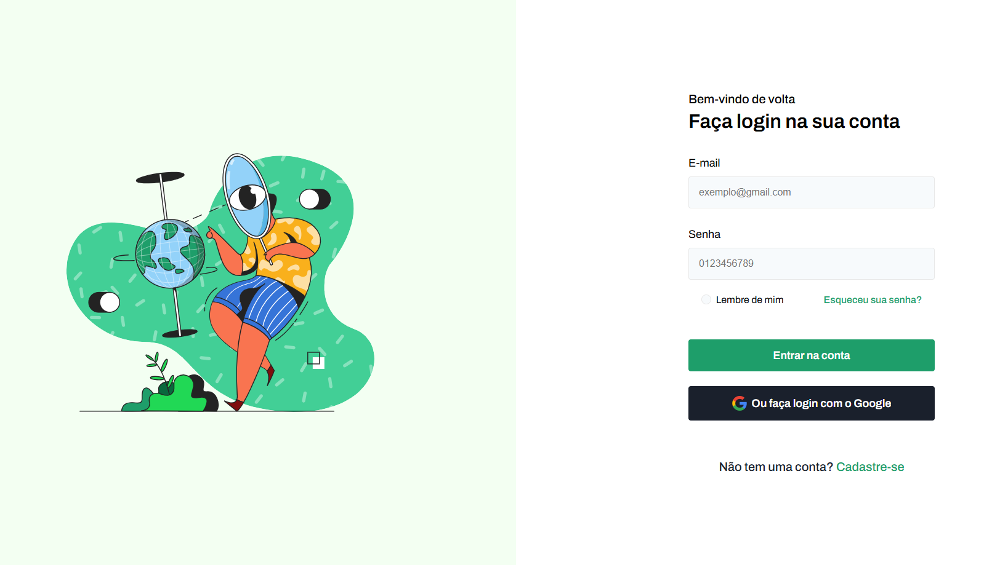
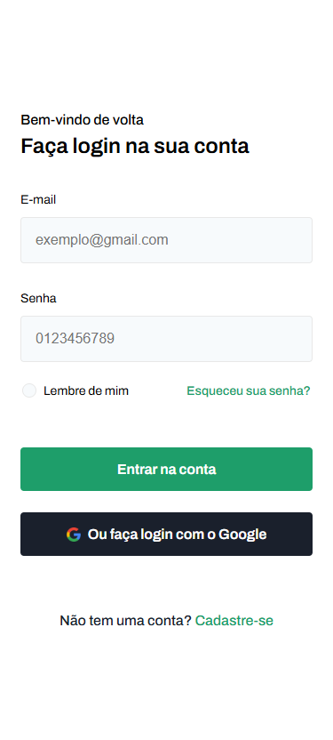

# Codelab - Login

### Links

- Site URL: [Site ativo](https://lucassalles-git.github.io/login/)




### Construído com

- Marcação semântica HTML5
- Propriedades personalizadas CSS
- Flexbox
- Fluxo de trabalho mobile-first
- [Sass](https://sass-lang.com/) - Para estilos

### O que eu aprendi

```scss
input[type="checkbox"] {
        appearance: none; //desativa estilo padrão do checkbox
        -webkit-appearance: none; //para navegadores Webkit

        &:checked {
          /*ao clicar*/
          background-color: $brand-color;
        }
      }
```

## Autor

- GitHub - [lucassalles-git](https://github.com/lucassalles-git)